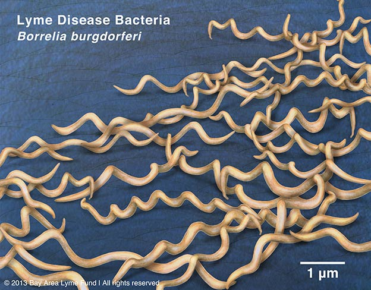

[My Github] (https://github.com/CBMontminy)

# Importing Data

```{r}
Sequences=read.csv("Sequences.csv")
```


```{r}
Sequences$Sequence
```
# Creating a for loop to count the number of nucleotides
```{r}
for(i in 1:3){
  print(paste("Number of A's in sequence", i, "-", nchar(gsub("A", "", Sequences$Sequence[i]))))
  print(paste("Number of T's in sequence", i, "-", nchar(gsub("T", "", Sequences$Sequence[i]))))
  print(paste("Number of G's in sequence", i, "-", nchar(gsub("G", "", Sequences$Sequence[i]))))
  print(paste("Number of C's in sequence", i, "-", nchar(gsub("C", "", Sequences$Sequence[i]))))
}
```
```{r}
Seq1=c(327, 367, 350, 399)
Seq2=c(326, 367, 350, 400)
Seq3=c(327, 366, 350, 400)
SeqTab=rbind(Seq1, Seq2, Seq3)
colnames(SeqTab)=c("A's", "T's", "G's", "C's")
rownames(SeqTab)=c("Sequence 1", "Sequence 2", "Sequence 3")
SeqTab
```

```{r echo=F, out.width="75%", fig.align="center"}

```
[Image Link](https://www.bayarealyme.org/about-lyme/what-causes-lyme-disease/borrelia-burgdorferi/)


[Wikipedia Link to Borrelia burgdorferi](https://en.wikipedia.org/wiki/Borrelia_burgdorferi)

# GC Content

## Calculate GC content

```{r}
GC=paste((SeqTab[,4]+SeqTab[,3])/(SeqTab[,1]+SeqTab[,2]+SeqTab[,3]+SeqTab[,4])*100)
```
## Creating a dataframe to output a table


```{r}
ID=gsub(">(HQ.*\\.1).*", "\\1", Sequences$Name)
GC=c((350+399)/(327+367+350+399)*100, (350+400)/(326+367+350+400)*100, (350+400)/(327+366+350+400)*100)
GC=round(GC, digits=2)
GCCont=data.frame(ID, GC)
colnames(GCCont)=c("ID", "GC Content (%)")
print(GCCont)
```


# Part II

Human isolate, unknown sequence
GCCTGATGGAGGGGGATAACTACTGGAAACGGTAGCTAATACCGCATGACCTCGCAAGAGCAAAGTGGGGGACCT TAGGGCCTCACGCCATCGGATGAACCCAGATGGGATTAGCTAGTAGGTGGGGTAATGGCTCACCTAGGCGACGAT CCCTAGCTGGTCTGAGAGGATGACCAGCCACACTGGAACTGAGACACGGTCCAGACTCCTACGGGAGGCAGCAGT GGGGAATATTGCACAATGGGCGCAA

## Creating sequence object
```{r}
UnknSeq="GCCTGATGGAGGGGGATAACTACTGGAAACGGTAGCTAATACCGCATGACCTCGCAAGAGCAAAGTGGGGGACCTTAGGGCCTCACGCCATCGGATGAACCCAGATGGGATTAGCTAGTAGGTGGGGTAATGGCTCACCTAGGCGACGATCCCTAGCTGGTCTGAGAGGATGACCAGCCACACTGGAACTGAGACACGGTCCAGACTCCTACGGGAGGCAGCAGTGGGGAATATTGCACAATGGGCGCAA"
```


## Loading packages
```{r}
library(annotate)
```
## Conducting BLAST search for the unknown sequence

```{r eval=F}
Blast=blastSequences(UnknSeq, timeout=240, hitListSize=10, as='data.frame')
```
## Loading BLAST object from Blaste.R script
```{r}
Blast=read.csv("Blast.csv")
```

# Results

## Removing repetitve hits
```{r}
Data=Blast[!duplicated(Blast$Hit_id),]
```

## Producing tables

```{r}
ID=Data$Hit_id
Score=Data$Hsp_score
Gap=Data$Hsp_gaps
Def=Data$Hit_def
Tab1=data.frame(ID, Score, Gap)
colnames(Tab1)=c("Hit ID", "Hit Score", "Gaps in Sequence")
```

```{r}
Tab2=data.frame(ID,Def)
colnames(Tab2)=c("Hit ID", "Host")
print(Tab1)
print(Tab2)
```

As you can see, all of our 10 matches have a score of 500 with no gaps in the sequence, indicating 100% query coverage and that they are the exact matches.  

From the host of the sequence matches, we get 9/10 for Yersinia pestis.  The other 1/10 is for Yersinia pseudotuberculosis, a close relative of Y, pestis, indicating that this sequence may be conserved across species.  Given the results, however, it is more likely that the unknown strand in the patient belongs to Yersinia pestis. 


This indicates that the patient is likely suffering from one of the three forms of the plague due to an infection with Yersinia pestis, which is highly concerning, and should be dealt with immediately.

Yersinia pestis is a gram negative bacterium that can infect humans.Yarsinia pestis is the bacteria responsible for the Black Death and causes the plague.  The forms of the plague can vary depending on location of infection.  Pneumonic plague infects the lungs, the bubonic plague affects the lymph nodes, and the septicemic plague infects the blood.

The bubonic and septicemic forms of the plague can be transmitted to humans via the Oriental rat flea, while the pneumonic  is typically spread between people via infectious droplets in the air.


